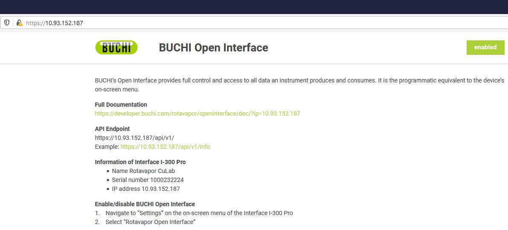

## Introduction

BUCHI’s OpenInterface is the key to monitor and remotely access your BUCHI Rotavapor. It requires to connect the Rotavapor to a local area network (LAN) and provides approximately the same amount of functionality as the device’s on-screen menu.

OpenInterface is a RESTful HTTP Service that runs directly on your BUCHI Rotavapor. Apart from this readme file, the following resources are available:

* [HTML API Documentation](https://developer.buchi.digital/rotavapor/openinterface/doc/index.html)
* [OpenAPI File](https://github.com/buchi-labortechnik-ag/openinterface_rotavapor/blob/master/rotavapor_openinterface.yaml)
* [Python Examples](https://github.com/buchi-labortechnik-ag/openinterface_examples_python)

 

## Common use cases

### Process control/monitoring (High Level)

-  Start / stop distillations

-  Adjust process parameters (e.g. set vacuum during distillation)

-  Monitor running distillations

-  Centralized monitoring of instrument usage/availability

-  Anomaly detection

### Subsystem control (Low Level)

- Using a BUCHI vacuum pump, heating bath, etc. in a system other than a Rotavapor.

## Hardware support
### BUCHI R-300
BUCHI's Rotavapor R-300 line is a modular system. All current generation subdevices are supported, but an [Interface I-300 Pro](https://www.buchi.com/en/products/laboratory-evaporation/interface-i-300-pro) with VacuBox is always required.

### BUCHI R-220
The R-220 Pro is currently not supported. If a R-220 Pro is detected, the OpenInterface is disabled on the I-300 Pro. 

## Getting started

### Wiring and IP configuration

Ensure that the I-300 Pro is connected to your network by plugging a LAN cable to the connector (see below) on the back side.

Either configure a fixed IP address in the I-300 Pro on-screen menu (Settings > Network) or set up an address reservation on your DHCP server in order to ensure that your Rotavapor system is always reachable under the same IP address.

### Enable OpenInterface

OpenInterface is disabled by default. For enabling it, use the I-300 Pro on-screen menu (Settings > Rotavapor Open Interface, see below). Take note of the passwords and restart the device: 

- _Password read_: Username 'ro', read access only
- _Password write_: Username 'rw', read and write/control access

On your computer, open a web browser and enter the IP address of your system. A webpage that shows the current status of the OpenInterface should be displayed (see below).

### API documentation
The API documentation is provided as an OpenAPI document on [GitHub](https://github.com/buchi-labortechnik-ag/openinterface_rotavapor/blob/master/rotavapor_openinterface.yaml). That document is mostly usable together with [OpenAPI tooling](https://openapi.tools/). For human consumtion we also provide the documentation as an [HTML version](https://developer.buchi.digital/rotavapor/openinterface/doc/index.html).

### Explore the API

Use [Postman](https://www.getpostman.com/) or it's open-source alternative [Insomnia](https://insomnia.rest/) for exploring the OpenInterface. Download and import the OpenInterface OpenApi file from [GitHub](https://github.com/buchi-labortechnik-ag/openinterface_rotavapor/blob/master/rotavapor_openinterface.yaml). Once imported, a few more things need to be configured:

- _Disable Certificate Verification:_ In Postman this can be done under File > Settings > General > SSL Certificate Verification

- _Enter Rotavapor IP Address:_ Change base URL to contain your Rotavapor's IP address under Edit Collection > Variables

- _Add credentials:_ Under Edit Collection > Authentication choose Basic Auth, enter rw as user and the password that was shown on screen of the I-300 Pro at the time you've enabled the OpenInterface.

- _Change Authorization:_ For each request inside the collection, in the Authorization tab, change Type to 'Inherit auth from parent'

Afterwards you should be able to use Postman for exploring the API.

### Examples
We provide a couple of Python examples on [GitHub](https://github.com/buchi-labortechnik-ag/openinterface_examples_python).

## Authentication

Basic authentication is used. This is one of the simplest forms of
authentication and involves a username and password being sent along by the
client in the HTTP header of each request.

There are two predefined users, `rw` and `ro`. It is not
possible to define additional users. A new random password is set for
each user at the time of first enabling OpenInterface via the on-screen menu of the I-300 Pro.

## Authorization

The authorization is hard-wired to the two default users. User `ro` only has read access while user `rw` additionally has write/control access.

## Security

The OpenInterface is disabled by default and explicitly needs to be
activated via the I-300 Pro on-screen menu. The OpenInterface enforces encrypted
communication using TLS. It uses a self-signed certificate that is
generated for the device’s IP once the API is activated. All such certificates share a [common root certificate](https://raw.githubusercontent.com/buchi-labortechnik-ag/openinterface_rotavapor/master/root_cert.crt) that can be used for validation.

## Discovery

No discovery features are currently offered. The instrument’s IP address can be
determined by using its on-screen menu.

## Versioning

The version of the API is part of the URL.

## Webhooks

Webhooks are the web's callbacks. It's a lightweight low-latency alternative for status and error monitoring where polling would be disproportionate.
This also allows passing events to services like [IFTTT](https://ifttt.com/), [Microsoft Flow](https://flow.microsoft.com/), or [Zapier](https://zapier.com/).

The OpenInterface is used for managing the webhook registrations. A webhook registration at the bare minumum is an URL and a list of Rotavapor Events. Whenever such an event occurs, the rotavapor will call that URL. 

### Templates

When registering for a webhook a template containing placeholders can be
provided. The placeholders are then populated with corresponding data at the
time the event occurs.

Currently only text templates are supported (e.g. JSON, XML, CSV, etc.)

### Certificate verification

Both http and https is supported. If https is used, server certificates will be validated.

If the instrument is in an isolated network without internet access, the “disableCertCheck” flag should be set when registering webhooks in order to ensure that the webhook is called even when the instrument is unable to properly verify the server’s certificate.

### Authentication

When registering a Webhook it is possible to specify additional headers.
Therefore HTTP basic authentication or a custom header with an access key
can be used. There is no support for other types of authentication.